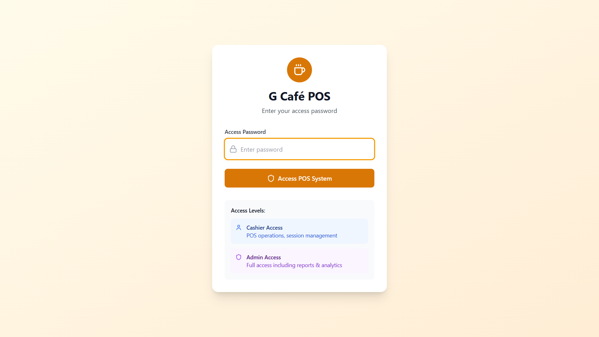
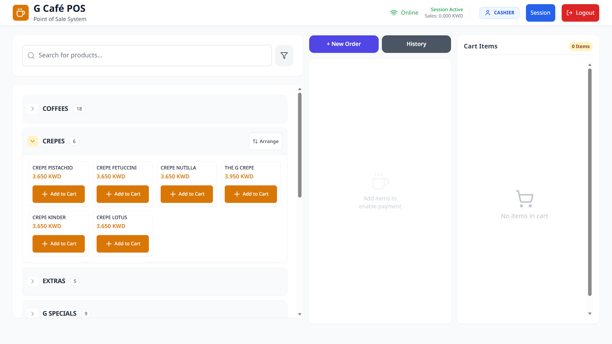
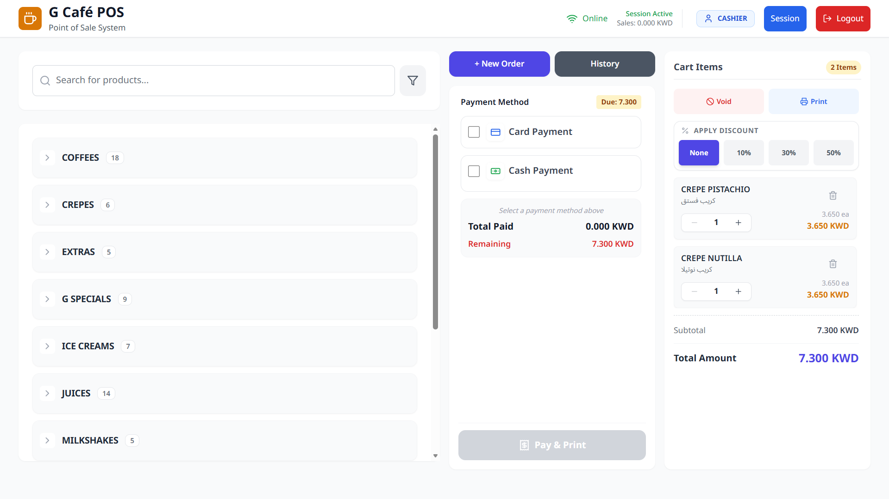
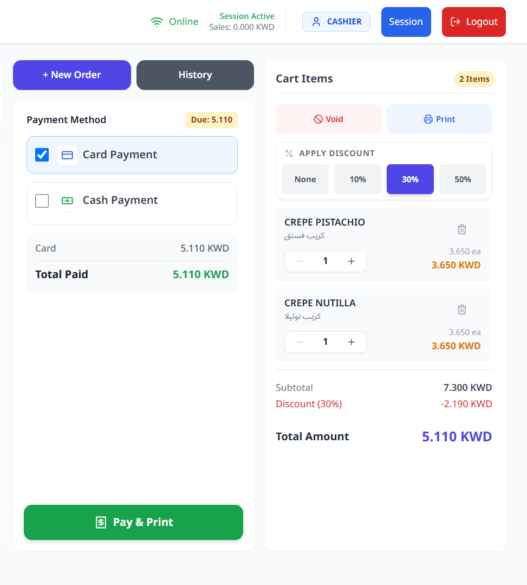
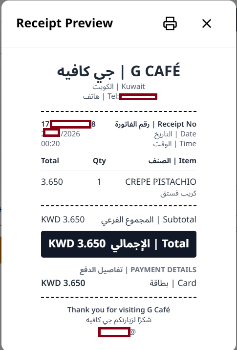
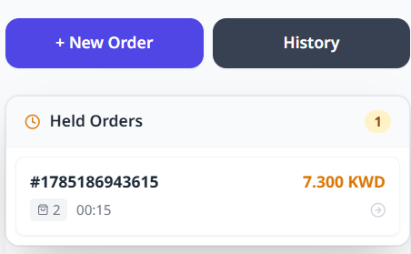
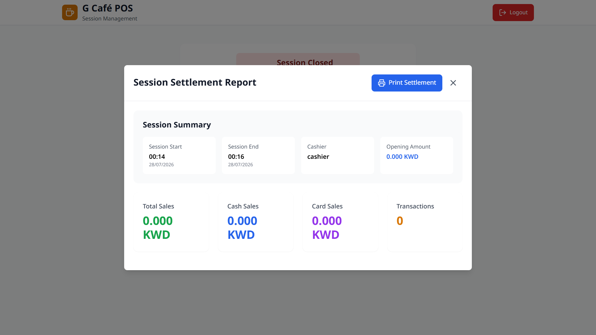
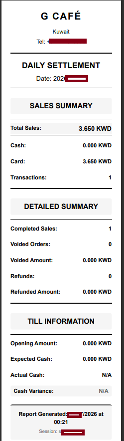
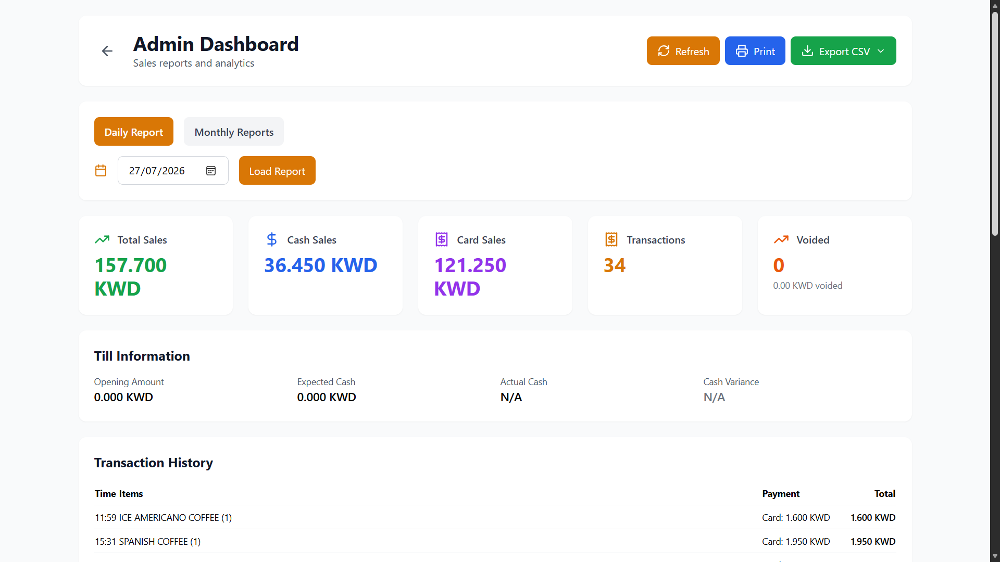
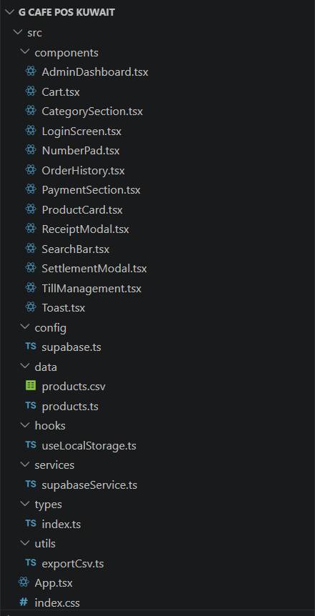

# ☕ G Cafe POS System

> A modern Point of Sale (POS) system developed for **G Cafe Kuwait**, designed to streamline café operations, order management, payments, and daily business reporting.

---

## 📖 Project Overview

The **G Cafe POS System** is a modern web-based application built for managing daily café operations.

The system enables staff to process customer orders, manage products and categories, handle payments, print receipts, monitor sales history, and perform end-of-day settlement operations through an intuitive and responsive interface.

> **Note**

> The source code is proprietary and owned by the client. This repository is intended solely as a portfolio showcase and contains screenshots and project documentation.

---

## 🚀 Technologies

| Technology | Purpose |
|------------|---------|
| React 18 | Frontend Framework |
| TypeScript | Static Typing |
| Vite | Build Tool |
| Supabase | Database & Backend |
| React Router | Navigation |
| Tailwind CSS | Styling |
| PapaParse | CSV Import & Export |
| DnD Kit | Drag & Drop |
| Lucide React | Icons |

---

## ✨ Features

- Secure login system
- Point of Sale interface
- Product categories
- Shopping cart management
- Payment processing
- Receipt generation
- Order history
- Daily settlement reports
- Till management
- Product search
- CSV product import/export
- Responsive design
- Cloud database with Supabase

---

## 📸 Screenshots

### Login

---

### Point of Sale

---

### Shopping Cart

---

### Payment Processing

---

### Receipt Generation

---

### Order History

---

### Sales Summary

---

### End-of-Day Settlement

---

### Admin Dashboard

---

### Project Architecture

## 👨‍💻 My Contributions

- Designed the POS user interface
- Developed reusable React components
- Built the ordering workflow
- Implemented payment processing
- Developed receipt generation
- Integrated Supabase backend
- Built order history and reporting
- Created CSV import/export functionality
- Implemented responsive layouts
- Optimized application performance

---

## 🛠 Built With

- React
- TypeScript
- Vite
- Supabase
- React Router
- PapaParse
- DnD Kit
- Tailwind CSS

---

## 🔒 Source Code

The complete source code is proprietary and remains the intellectual property of the client.

This repository is published solely for portfolio purposes and contains screenshots and documentation only.

---

## 📄 License

This repository is provided for portfolio and demonstration purposes only.

The original application, branding, business logic, and implementation belong exclusively to the client.
